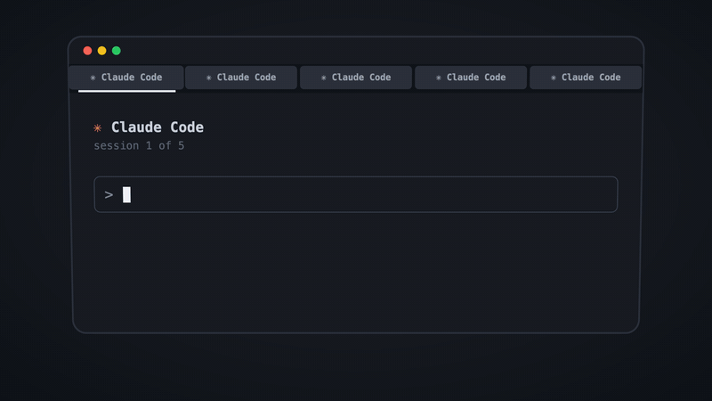

# tab-tag

[](LICENSE)

A [Claude Code](https://claude.com/claude-code) mod that gives every session's [iTerm2](https://iterm2.com) tab its own colour and a one- or two-word name, so you can tell five open sessions apart without clicking through them.



## What it does

| When | What happens to the tab |
|---|---|
| A session starts | It gets a random colour from a palette of twelve, and the name of the folder you started in |
| You send the first prompt | It is renamed to one or two uppercase words for what the prompt is about, for example `CHECKOUT TESTS` |
| The first prompt is a slash command | The command's name becomes the tab name: `/release-notes` gives `RELEASE NOTES` |
| The first prompt is a GitHub link and nothing else | The repository names the tab, with the issue or pull request number when there is room: `BRICKWISE 42` |
| The first prompt is any other link and nothing else | The tab keeps the folder's name until the turn ends, then it is named from what Claude read behind the link |
| You run `/tab HOTFIX` | The tab is named `HOTFIX` |
| You run `/tab` with no words | The tab is named again from the last prompts of the conversation |
| You resume a session | It gets back the colour and the name it had |
| You run `/clear` | The colour stays, and the next prompt names the tab again |
| The session ends | The tab goes back to iTerm2's default colour and title |

A tab is named once. Later prompts do not rename it, so the name does not change while you work. Use `/tab` when the subject changes.

## Requirements

- macOS with iTerm2. In any other terminal the mod does nothing.
- A Claude Code version with mods (plugins of function hooks). Tested with 2.1.294.

## Install

```bash
claude plugin marketplace add JCPetrelli/tab-tag
claude plugin install tab-tag@tab-tag
```

Start a new session in iTerm2 and the tab is coloured.

To remove it:

```bash
claude plugin uninstall tab-tag@tab-tag
claude plugin marketplace remove tab-tag
```

## Codex

The [`codex/`](codex) folder holds the same tool as a plugin for the [Codex CLI](https://github.com/openai/codex). It needs Node.js. It is new: the tests run the hook script, but not yet a full Codex session.

```bash
codex plugin marketplace add JCPetrelli/tab-tag
codex plugin add tab-tag@tab-tag
```

Then start `codex` in iTerm2, run `/hooks` and trust the four tab-tag hooks. Codex does not run a plugin's hooks before you trust them.

The Codex plugin makes no model call: the name is the first two telling words of your first prompt. A link to anywhere but GitHub leaves the name to the next prompt. There is no `/tab` command.

## The naming model

The name comes from one small model call per session: the first 1,500 characters of your first prompt go to the model, and the reply is limited to 16 tokens. The default model is `claude-haiku-5-5`.

You can change the model with `/plugin configure tab-tag@tab-tag`, option **Naming model**. If you leave that option empty, the mod makes no model call and uses the first two telling words of the prompt (`i want to find slow queries in the search page` gives `SLOW QUERIES`).

The mod uses the same fallback when the model does not answer.

## How it works

| File | Job |
|---|---|
| [`hooks/register.ts`](hooks/register.ts) | The hooks: colour and name at `session.start`, naming at `prompt.submit`, the `/tab` command, reset at `session.end` |
| [`hooks/words.ts`](hooks/words.ts) | The palette, and the rules that turn text into a title |
| [`bin/tab.sh`](bin/tab.sh) | Writes iTerm2's escape sequences for tab title and tab colour to the session's terminal |
| [`tests/tab.test.ts`](tests/tab.test.ts) | Tests for the title rules and for a full session |
| [`codex/hooks/tab-tag.mjs`](codex/hooks/tab-tag.mjs) | The Codex plugin: one script for Codex's `SessionStart`, `UserPromptSubmit`, `Stop` and `SessionEnd` hooks |

Two details:

- Claude Code writes its own tab title when a turn starts and when it ends. The mod writes its title again at those moments, and once more 1.5 seconds later.
- A title contains only the letters A to Z, the digits and spaces. A prompt or a model reply cannot put an escape sequence into your terminal through the tab name.

Colour and name are saved per session ID in the mod's own store. The mod keeps the last 300 sessions.

## Limits

- iTerm2 only. Other terminals have different escape sequences for tab colour, or none.
- The colour is random, so two sessions can get the same one.
- Another tool that sets the tab colour or title for the same session (for example [TabChroma](https://github.com/JCPetrelli/TabChroma), which colours the tab by Claude's state) will overwrite this one, or be overwritten by it.

## Development

```bash
git clone https://github.com/JCPetrelli/tab-tag
cd tab-tag
claude plugin validate .   # manifest and hooks, as the engine reads them
claude plugin test .       # tests/*.test.ts
node --test codex/tests/tab-tag.test.mjs   # the Codex plugin
```

To try your copy in a session, add the folder as a marketplace (`claude plugin marketplace add ./tab-tag`) and install from it. After an edit, run `/reload-plugins` in the session.

### The animation

The demo is a [three.js](https://threejs.org) scene in one file, [`docs/animation/index.html`](docs/animation/index.html). Open the file in a browser to see it loop. To render the video and the GIF again (needs Google Chrome and ffmpeg):

```bash
cd docs/animation
npm install
node render.mjs
```

## Licence

[MIT](LICENSE)
